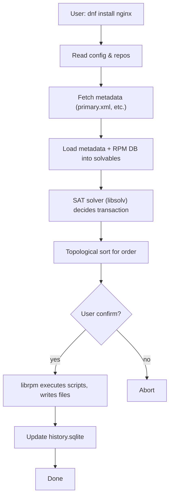

# Chapter 15: Installing and Updating Software Packages – Complete Red Hat Package Management Guide

## Table of Contents

- [Chapter 15: Installing and Updating Software Packages – Complete Red Hat Package Management Guide](#chapter-15-installing-and-updating-software-packages--complete-red-hat-package-management-guide)
  - [Table of Contents](#table-of-contents)
  - [1. What is a Package?](#1-what-is-a-package)
  - [2. Package Extensions and Formats](#2-package-extensions-and-formats)
    - [2.1 Source Archives – Third‑Party / Upstream](#21-source-archives--thirdparty--upstream)
    - [2.2 Binary Packages](#22-binary-packages)
    - [2.3 Source RPM (`.src.rpm`)](#23-source-rpm-srcrpm)
  - [3. RPM: The Low‑Level Package Manager](#3-rpm-the-lowlevel-package-manager)
    - [3.1 RPM Naming Convention](#31-rpm-naming-convention)
    - [3.2 RPM Architectures](#32-rpm-architectures)
    - [3.3 Basic RPM Operations](#33-basic-rpm-operations)
    - [3.4 RPM Querying and Verification](#34-rpm-querying-and-verification)
    - [3.5 Integrity Checking (Checksums)](#35-integrity-checking-checksums)
    - [3.6 Problems with RPM – Dependency Hell](#36-problems-with-rpm--dependency-hell)
  - [4. The Evolution: YUM and DNF](#4-the-evolution-yum-and-dnf)
    - [4.1 Why YUM Came – Solving Dependency Hell](#41-why-yum-came--solving-dependency-hell)
    - [4.2 DNF – The Modern Replacement](#42-dnf--the-modern-replacement)
  - [5. Repositories – The Backbone of Modern Package Management](#5-repositories--the-backbone-of-modern-package-management)
    - [5.1 What is a Repository?](#51-what-is-a-repository)
    - [5.2 Repository Types](#52-repository-types)
    - [5.3 Repository Configuration Files (`.repo`)](#53-repository-configuration-files-repo)
    - [5.4 Anatomy of a `.repo` File](#54-anatomy-of-a-repo-file)
    - [5.5 Creating a Local Repository](#55-creating-a-local-repository)
    - [5.6 GPG Keys and the PKI Folder](#56-gpg-keys-and-the-pki-folder)
  - [6. Red Hat Subscription Management](#6-red-hat-subscription-management)
    - [6.1 Why Subscribe?](#61-why-subscribe)
    - [6.2 How to Subscribe](#62-how-to-subscribe)
    - [6.3 Using Free Repos (CentOS, Fedora, Rocky, AlmaLinux)](#63-using-free-repos-centos-fedora-rocky-almalinux)
  - [7. DNF – The Modern Package Manager](#7-dnf--the-modern-package-manager)
    - [7.1 Basic DNF Operations](#71-basic-dnf-operations)
    - [7.2 DNF History (Undo, Redo, Rollback)](#72-dnf-history-undo-redo-rollback)
    - [7.3 DNF Modules and AppStream](#73-dnf-modules-and-appstream)
    - [7.4 DNF Logs](#74-dnf-logs)
    - [7.5 Group Installations (e.g., Web Server)](#75-group-installations-eg-web-server)
  - [8. DNF Under the Hood – Complete Workflow](#8-dnf-under-the-hood--complete-workflow)
    - [Phase 1: CLI Parsing \& Configuration](#phase-1-cli-parsing--configuration)
    - [Phase 2: Repository Setup \& Metadata Fetching](#phase-2-repository-setup--metadata-fetching)
    - [Phase 3: Metadata Loading into libsolv](#phase-3-metadata-loading-into-libsolv)
    - [Phase 4: Goal Setting \& SAT Solving](#phase-4-goal-setting--sat-solving)
    - [Phase 5: Transaction Planning (Ordering)](#phase-5-transaction-planning-ordering)
    - [Phase 6: User Confirmation](#phase-6-user-confirmation)
    - [Phase 7: RPM Worker Execution (`librpm`)](#phase-7-rpm-worker-execution-librpm)
    - [Phase 8: History Recording](#phase-8-history-recording)
    - [8.2 All‑in‑One Diagram (Mermaid)](#82-allinone-diagram-mermaid)
  - [9. Comparison: DNF vs. APT](#9-comparison-dnf-vs-apt)
  - [10. Important Files and Directories](#10-important-files-and-directories)
  - [11. Quick Reference Table](#11-quick-reference-table)
  - [12. Practice Lab – Verify Your Understanding](#12-practice-lab--verify-your-understanding)
  - [13. Real‑World Scenario – Deploying a Web Application Stack](#13-realworld-scenario--deploying-a-web-application-stack)
    - [Background](#background)
    - [Scenario Steps](#scenario-steps)
      - [1. Verify existing repositories and GPG keys](#1-verify-existing-repositories-and-gpg-keys)
      - [2. Check for updates and apply the latest patches](#2-check-for-updates-and-apply-the-latest-patches)
      - [3. Install the EPEL repository (for additional tools like `htop`)](#3-install-the-epel-repository-for-additional-tools-like-htop)
      - [4. Search and install Nginx (from AppStream)](#4-search-and-install-nginx-from-appstream)
      - [5. Determine which package provides the `redis-server` binary](#5-determine-which-package-provides-the-redis-server-binary)
      - [6. Use AppStream modules to install a recent Node.js version](#6-use-appstream-modules-to-install-a-recent-nodejs-version)
      - [7. Install development tools via group install](#7-install-development-tools-via-group-install)
      - [8. Examine transaction history](#8-examine-transaction-history)
      - [9. Create a local repository for a custom package (e.g., `myapp`)](#9-create-a-local-repository-for-a-custom-package-eg-myapp)
      - [10. Use DNF history to undo a mistaken installation](#10-use-dnf-history-to-undo-a-mistaken-installation)
      - [11. Clean up unused dependencies and cache](#11-clean-up-unused-dependencies-and-cache)
      - [12. Verify the final system state](#12-verify-the-final-system-state)

---

## 1. What is a Package?

In Linux, a **package** is a distributable archive that contains software (binaries, configuration files, documentation) together with metadata: version, dependencies, description, checksums, and installation scripts. Packages are the units that package managers work with.

| Property | Description |
|----------|-------------|
| **Binaries** | Compiled executable files |
| **Configuration** | Default config files (e.g., `/etc/nginx/nginx.conf`) |
| **Metadata** | Name, version, release, architecture, dependencies |
| **Scripts** | Pre‑install, post‑install, pre‑uninstall, etc. |
| **Digital signature** | GPG signature to verify authenticity |

---

## 2. Package Extensions and Formats

### 2.1 Source Archives – Third‑Party / Upstream

| Extension | Compression | Typical Use |
|-----------|-------------|--------------|
| `.tar.gz` or `.tgz` | gzip | Source code tarballs |
| `.tar.bz2` or `.tbz2` | bzip2 | Source code (better compression) |
| `.tar.xz` or `.txz` | xz | Modern source tarballs |

These are **not** binary packages – you compile them manually (`./configure && make && make install`). They do **not** integrate with the package database.

### 2.2 Binary Packages

| Family | Extension | Low‑Level Tool | High‑Level Manager |
|--------|-----------|----------------|--------------------|
| **Red Hat (RHEL, Fedora, CentOS, Rocky, AlmaLinux)** | `.rpm` | `rpm` | `dnf` / `yum` |
| **Debian (Ubuntu, Debian, Mint, Kali)** | `.deb` | `dpkg` | `apt` |

### 2.3 Source RPM (`.src.rpm`)

Contains the source code and the `.spec` file used to build a binary RPM. Used by developers and for rebuilding packages.

---

## 3. RPM: The Low‑Level Package Manager

RPM (Red Hat Package Manager) is the **worker** that installs, upgrades, and removes `.rpm` files. It maintains a local database (`/var/lib/rpm/`).

### 3.1 RPM Naming Convention

```
package-name-version-release.architecture.rpm
```

**Example:** `nginx-1.20.1-10.el9.x86_64.rpm`

| Part | Example | Meaning |
|------|---------|---------|
| `package-name` | `nginx` | Name of the software |
| `version` | `1.20.1` | Upstream version |
| `release` | `10.el9` | Package release number (including distribution) |
| `architecture` | `x86_64` | CPU architecture (see below) |
| `.rpm` | – | Extension |

### 3.2 RPM Architectures

| Arch | Meaning |
|------|---------|
| `x86_64` | 64‑bit Intel/AMD |
| `i686`, `i586` | 32‑bit x86 |
| `aarch64` | 64‑bit ARM |
| `ppc64le` | PowerPC 64‑bit little‑endian |
| `noarch` | Architecture‑independent (e.g., Python scripts, fonts) |
| `src` | Source RPM |

### 3.3 Basic RPM Operations

| Operation | Command | Example |
|-----------|---------|---------|
| **Install** | `rpm -ivh package.rpm` | `rpm -ivh nginx-1.20.1-10.el9.x86_64.rpm` |
| **Upgrade** (install or update) | `rpm -Uvh package.rpm` | `rpm -Uvh nginx-1.22.0.rpm` |
| **Erase** (uninstall) | `rpm -e package-name` | `rpm -e nginx` |
| **Query** all installed | `rpm -qa` | `rpm -qa \| grep nginx` |
| **Query info** | `rpm -qi package` | `rpm -qi nginx` |
| **List files in package** | `rpm -ql package` | `rpm -ql nginx` |
| **Which package owns a file** | `rpm -qf /path/file` | `rpm -qf /etc/nginx/nginx.conf` |
| **Verify package** | `rpm -V package` | `rpm -V nginx` |

**Important options:**
- `-i` : install
- `-U` : upgrade
- `-e` : erase
- `-q` : query
- `-a` : all
- `-l` : list files
- `-f` : file query
- `-V` : verify (checksum, size, permissions)
- `-v` : verbose
- `-h` : hash marks (progress)

### 3.4 RPM Querying and Verification

```bash
# Verify all installed packages (checks sizes, MD5, permissions)
rpm -Va

# Verify a specific package
rpm -V nginx

# Output: S.5....T. c /etc/nginx/nginx.conf
# S = file size differs
# 5 = MD5 checksum differs
# T = modification time differs
# c = configuration file
```

### 3.5 Integrity Checking (Checksums)

RPM includes **MD5/SHA256** checksums of every file. When you query, RPM compares stored checksums with actual files. You can also verify the GPG signature of the package itself:

```bash
rpm -K package.rpm
# Output: package.rpm: rsa sha1 (md5) pgp md5 OK
```

### 3.6 Problems with RPM – Dependency Hell

RPM only checks dependencies at installation time; it **cannot** automatically download missing dependencies. If a package requires `libssl.so.3`, RPM just says:

```
error: Failed dependencies: libssl.so.3()(64bit) is needed by nginx-1.20.1-10.el9.x86_64
```

You then have to manually find and install that library's RPM. This recursive search is **Dependency Hell**. To solve this, **YUM** was created.

---

## 4. The Evolution: YUM and DNF

### 4.1 Why YUM Came – Solving Dependency Hell

**YUM (Yellowdog Updater, Modified)** introduced:
- **Repositories** – central servers with thousands of packages.
- **Automatic dependency resolution** – YUM reads metadata, finds required packages, and downloads them.
- **Transaction model** – a single `yum install` can pull dozens of dependencies.

YUM became the standard in RHEL 5 and remained until RHEL 7.

### 4.2 DNF – The Modern Replacement

Starting with **Fedora 18** and **RHEL 8**, DNF (Dandified YUM) replaced YUM.

| Feature | YUM (legacy) | DNF (modern) |
|---------|--------------|---------------|
| Core language | Python 2 | C++ (libdnf) + Python wrapper |
| Dependency solver | `yum` own (slow) | `libsolv` (SAT solver, faster) |
| Memory usage | High | Lower |
| Parallel downloads | No | Yes (`max_parallel_downloads`) |
| History undo | Basic | Robust (`dnf history undo`) |
| Modularity (AppStream) | No | Yes |

**Commands are almost identical** – `yum` is a symlink to `dnf` on most newer systems.

---

## 5. Repositories – The Backbone of Modern Package Management

### 5.1 What is a Repository?

A repository is an HTTP/HTTPS, FTP, or local directory containing:
- **RPM files**
- **Metadata** (repodata) – `repomd.xml`, `primary.xml.gz`, `filelists.xml.gz`, etc.

### 5.2 Repository Types

| Type | Description | Example |
|------|-------------|---------|
| **Public** | Official distribution repos (RHEL, CentOS, Fedora) | `baseos`, `appstream`, `epel` |
| **Third‑party** | Community or vendor repos | `EPEL`, `RPMfusion`, `Remi` |
| **Local** | On your own filesystem or network | `file:///mnt/local-repo` |
| **Source** | Contains `.src.rpm` files | – |

### 5.3 Repository Configuration Files (`.repo`)

Location: `/etc/yum.repos.d/` (all files ending in `.repo`)

### 5.4 Anatomy of a `.repo` File

```ini
[repo-id]                     # Unique identifier (e.g., appstream)
name=Repository Name          # Human‑readable description
baseurl=http://example.com/path/to/repo   # Main URL
mirrorlist=http://mirrorlist.example.com  # Alternative to baseurl
enabled=1                     # 1 = enabled, 0 = disabled
gpgcheck=1                    # Verify GPG signatures
gpgkey=file:///etc/pki/rpm-gpg/RPM-GPG-KEY-redhat-release
sslverify=1                   # Verify SSL certificates
metadata_expire=86400         # Cache expiry in seconds (24h)
priority=1                    # Priority of repository (lowest number = highest)
```

**Variables in URLs:**
- `$releasever` – OS version (e.g., 9)
- `$basearch` – architecture (e.g., x86_64)

**Example (RHEL 9 AppStream):**
```ini
[appstream]
name=AppStream
baseurl=http://download.example.com/rhel/9/AppStream/x86_64/os/
gpgcheck=1
enabled=1
gpgkey=file:///etc/pki/rpm-gpg/RPM-GPG-KEY-redhat-release
```

### 5.5 Creating a Local Repository

1. **Install `createrepo`**:
   ```bash
   sudo dnf install createrepo
   ```

2. **Create directory and copy RPMs**:
   ```bash
   mkdir -p /var/local/myrepo
   cp *.rpm /var/local/myrepo/
   ```

3. **Generate metadata**:
   ```bash
   createrepo /var/local/myrepo
   ```

4. **Create `.repo` file** pointing to `file:///var/local/myrepo`.

### 5.6 GPG Keys and the PKI Folder

- **Location of public GPG keys:** `/etc/pki/rpm-gpg/`
- **Common keys:**
  - `RPM-GPG-KEY-redhat-release` – RHEL official
  - `RPM-GPG-KEY-epel-9` – EPEL for RHEL 9
  - `RPM-GPG-KEY-fedora` – Fedora

**What is a GPG key?** A cryptographic key used to sign packages. DNF verifies the signature before installation to ensure the package came from a trusted source and hasn't been tampered with.

**Import a GPG key manually:**
```bash
sudo rpm --import /path/to/key.asc
```

**Check imported keys:**
```bash
rpm -qa gpg-pubkey*
```

---

## 6. Red Hat Subscription Management

### 6.1 Why Subscribe?

RHEL repositories are not public – they require a **subscription** to access updates, security patches, and official support.

### 6.2 How to Subscribe

**CLI using `subscription-manager`:**
```bash
# Register the system
sudo subscription-manager register --username your_rh_username --password your_rh_password

# Attach a subscription (auto‑attach)
sudo subscription-manager attach --auto

# List available repos
sudo subscription-manager repos --list

# Enable specific repos (e.g., AppStream, BaseOS)
sudo subscription-manager repos --enable rhel-9-for-x86_64-appstream-rpms --enable rhel-9-for-x86_64-baseos-rpms
```

**GUI:** `gnome-software` or `subscription-manager-gui`.

### 6.3 Using Free Repos (CentOS, Fedora, Rocky, AlmaLinux)

If you don't have a RHEL subscription, you can use:
- **CentOS Stream** (free rolling release)
- **Rocky Linux** / **AlmaLinux** (bug‑for‑bug compatible with RHEL, free)
- **Fedora** (cutting‑edge, free)

These distributions have their own public repositories, pre‑configured after installation.

**Third‑party repositories (free):**
- **EPEL** (Extra Packages for Enterprise Linux): `sudo dnf install epel-release`
- **RPMfusion** (for multimedia, codecs): `sudo dnf install https://download1.rpmfusion.org/free/el/rpmfusion-free-release-9.noarch.rpm`

---

## 7. DNF – The Modern Package Manager

### 7.1 Basic DNF Operations

| Operation | Command | Example |
|-----------|---------|---------|
| **Search** | `dnf search keyword` | `dnf search nginx` |
| **Info** (package details) | `dnf info package` | `dnf info nginx` |
| **Install** | `sudo dnf install package` | `sudo dnf install nginx` |
| **Install from local file** | `sudo dnf install ./package.rpm` | `sudo dnf install ./nginx.rpm` |
| **Update** (single package) | `sudo dnf update package` | `sudo dnf update nginx` |
| **Upgrade** (all packages) | `sudo dnf upgrade` | `sudo dnf upgrade` |
| **Remove** | `sudo dnf remove package` | `sudo dnf remove nginx` |
| **Autoremove** (unused dependencies) | `sudo dnf autoremove` | – |
| **List installed** | `dnf list installed` | `dnf list installed \| grep nginx` |
| **List available** | `dnf list available` | – |
| **Check for updates** | `dnf check-update` | – |
| **Provides** (which package owns a file) | `dnf provides /path/file` | `dnf provides /etc/nginx/nginx.conf` |
| **Clean cache** | `sudo dnf clean all` | – |
| **Make cache** (force refresh) | `sudo dnf makecache` | – |

**Important options:**
- `-y` (assume yes) – non‑interactive
- `--downloadonly` – download packages without installing
- `--nogpgcheck` – skip GPG verification (not recommended)
- `--nobest` – do not force the "best" version (allow older)
- `--allowerasing` – allow removal of conflicting packages

### 7.2 DNF History (Undo, Redo, Rollback)

DNF records every transaction in a SQLite database.

| Command | Description |
|---------|-------------|
| `dnf history` | List recent transactions (ID, date, command) |
| `dnf history info ID` | Details of a specific transaction |
| `dnf history undo ID` | Reverse a specific transaction |
| `dnf history redo ID` | Reapply a transaction (useful after accidental undo) |
| `dnf history rollback ID` | Revert system to the state after transaction ID |

**Example:**
```bash
sudo dnf install httpd
dnf history | head -5   # note transaction ID, say 42
sudo dnf history undo 42  # removes httpd and its dependencies (if not used by others)
```

### 7.3 DNF Modules and AppStream

**Modules** (also called "streams") allow you to install different versions of the same software from the same repository.

For example, on RHEL 9 AppStream, you can choose between:

```
dnf module list nodejs
# nodejs 18, nodejs 20
```

**Commands:**
```bash
# List available modules
dnf module list

# Enable a specific stream and install
sudo dnf module enable nodejs:20
sudo dnf install nodejs

# Switch to another stream (requires reset)
sudo dnf module reset nodejs
sudo dnf module enable nodejs:18
sudo dnf install nodejs
```

**AppStream** is the repository that provides these modules. It separates the OS base (BaseOS) from application streams.

### 7.4 DNF Logs

| Log file | Content |
|----------|---------|
| `/var/log/dnf.log` | Detailed logs of every DNF operation |
| `/var/log/dnf.rpm.log` | RPM transaction output (scripts, file installs) |
| `/var/log/dnf.librepo.log` | Repository download debug logs |

Useful for troubleshooting failed transactions.

### 7.5 Group Installations (e.g., Web Server)

DNF can install groups of packages that form a common environment.

```bash
# List all groups
dnf group list

# Install a group (e.g., Web Server)
sudo dnf group install "Web Server"

# More common: `sudo dnf install @web-server` (group name prefixed with @)
```

**Example groups:**
- `@base` – minimal installation
- `@development` – development tools
- `@virtualization` – KVM tools
- `@graphical-server` – GUI for servers

---

## 8. DNF Under the Hood – Complete Workflow

Below is the **complete step‑by‑step** process when you run `sudo dnf install nginx`.

### Phase 1: CLI Parsing & Configuration
- DNF reads `/etc/dnf/dnf.conf` and `/etc/dnf/conf.d/*.conf`.
- Reads all `.repo` files from `/etc/yum.repos.d/`.
- Expands variables (`$releasever`, `$basearch`).
- Initialises plugins.

### Phase 2: Repository Setup & Metadata Fetching
For each enabled repository:
- Checks local cache in `/var/cache/dnf/repoid-.../`.
- If cache stale (based on `metadata_expire`), downloads `repomd.xml`.
- Downloads `primary.xml.gz` (package list, dependencies), `filelists.xml.gz` (file‑to‑package mapping), `modules.yaml` (if AppStream), and `comps.xml` (groups).
- Verifies GPG signature of metadata if `repo_gpgcheck=1`.

### Phase 3: Metadata Loading into libsolv
- `libsolv` reads `primary.xml` and converts each package into a **solvable** (name, version, arch, provides, requires, conflicts, obsoletes).
- Also reads the RPM database (`/var/lib/rpm/rpmdb.sqlite`) to create solvables for installed packages.
- All solvables are placed into a **pool** (in‑memory).

### Phase 4: Goal Setting & SAT Solving
- The user’s request (`install nginx`) becomes a **goal** of type `JOB_INSTALL`.
- `libsolv` runs a **SAT solver** (CDCL algorithm) on the pool.
- It tries to find an assignment where all rules are satisfied and the goal is true.
- Output: a **transaction set** – list of actions (install, erase, upgrade) with exact NEVRA (name, epoch, version, release, arch).

### Phase 5: Transaction Planning (Ordering)
- Builds a dependency graph.
- Performs topological sort to decide execution order (erasures first, then installs in dependency order).
- Checks for conflicts (disk space, file collisions).

### Phase 6: User Confirmation
- Displays transaction table (packages to install/upgrade/remove, sizes).
- Waits for user input (`y` / `n`) – skipped if `-y`.

### Phase 7: RPM Worker Execution (`librpm`)
- Acquires lock on `/var/lib/rpm/.rpm.lock`.
- Runs global `%pretrans` scripts.
- For each package in order:
  - **Install/upgrade**: run `%pre`, unpack files, check conflicts, write files (atomic), run `%post`, update RPM database.
  - **Erase**: run `%preun`, remove files, run `%postun`, remove from database.
- Runs global `%posttrans` scripts.
- Releases lock.

### Phase 8: History Recording
- Writes transaction into `/var/lib/dnf/history.sqlite` (transaction ID, command line, timestamp, list of packages with actions).

### 8.2 All‑in‑One Diagram (Mermaid)



---

## 9. Comparison: DNF vs. APT

| Feature | DNF (Red Hat) | APT (Debian/Ubuntu) |
|---------|---------------|----------------------|
| Low‑level tool | `rpm` | `dpkg` |
| Package format | `.rpm` | `.deb` |
| Update cache | Automatic (but `dnf makecache` exists) | Manual (`apt update`) |
| History undo | Built‑in (`dnf history undo`) | Not native (use `apt log` + manual) |
| Parallel downloads | Yes (`max_parallel_downloads`) | Yes (in newer versions) |
| Dependency solving | `libsolv` (SAT) | `libapt-pkg` (graph) |
| Modularity (streams) | Yes (AppStream) | No (use snap/flatpak) |
| Configuration location | `/etc/dnf/dnf.conf` and `/etc/yum.repos.d/` | `/etc/apt/sources.list` and `/etc/apt/sources.list.d/` |
| Cache cleaning | `dnf clean all` | `apt clean`, `apt autoclean` |

---

## 10. Important Files and Directories

| File/Directory | Purpose |
|----------------|---------|
| `/etc/dnf/dnf.conf` | Main DNF configuration |
| `/etc/yum.repos.d/*.repo` | Repository definitions |
| `/var/cache/dnf/` | Cached metadata and downloaded packages |
| `/var/lib/dnf/history.sqlite` | Transaction history database |
| `/var/lib/rpm/` | RPM database (packages installed) |
| `/var/log/dnf.log` | DNF logs |
| `/var/log/dnf.rpm.log` | RPM transaction logs |
| `/etc/pki/rpm-gpg/` | GPG public keys for repositories |
| `/etc/dnf/plugins/` | DNF plugin configurations |
| `/etc/dnf/protected.d/` | Packages that cannot be removed (e.g., `systemd`, `kernel`) |

---

## 11. Quick Reference Table

| Task | Command |
|------|---------|
| Search for a package | `dnf search term` |
| Install a package | `sudo dnf install package` |
| Update a package | `sudo dnf update package` |
| Update all packages | `sudo dnf upgrade` |
| Remove a package | `sudo dnf remove package` |
| List installed packages | `dnf list installed` |
| List available packages | `dnf list available` |
| Show package info | `dnf info package` |
| Find which package owns a file | `dnf provides /path/file` |
| Enable a repository | `sudo dnf config-manager --set-enabled repoid` |
| Disable a repository | `sudo dnf config-manager --set-disabled repoid` |
| Clean cache | `sudo dnf clean all` |
| View transaction history | `dnf history` |
| Undo a transaction | `sudo dnf history undo ID` |
| Install a group | `sudo dnf group install "group name"` |
| List module streams | `dnf module list` |
| Enable a module stream | `sudo dnf module enable stream` |
| Install from local RPM | `sudo dnf install ./package.rpm` |

---

## 12. Practice Lab – Verify Your Understanding

1. **Query RPM database:** List all installed packages that contain "kernel" in their name.
2. **Find file owner:** Which package owns `/etc/passwd`? (`rpm -qf` or `dnf provides`)
3. **Check GPG keys:** List imported GPG keys (`rpm -qa gpg-pubkey*`).
4. **Create a local repo:**
   - Create a directory, download a few RPMs (e.g., `epel-release`), run `createrepo`.
   - Add a `.repo` file pointing to `file:///path`.
   - Install a package from that local repo.
5. **DNF history:**
   - Install a dummy package (e.g., `cowsay`).
   - Run `dnf history` to find the transaction ID.
   - Undo that transaction (`sudo dnf history undo ID`).
6. **Module test (if available):** List available `nodejs` modules. Enable one and install.
7. **Group install:** Install the "Development Tools" group (`dnf group install "Development Tools"`).
8. **Simulate a transaction without executing:** `sudo dnf install nginx --downloadonly --assumeno` (or use `--setopt=tsflags=test`).

---

## 13. Real‑World Scenario – Deploying a Web Application Stack

### Background

You are setting up a new CentOS 9 server that will host a PHP/Node.js web application with Nginx and Redis. The server already has the **AppStream** and **BaseOS** repositories enabled (via the CentOS default configuration). No third‑party repos are present yet.

### Scenario Steps

#### 1. Verify existing repositories and GPG keys
```bash
dnf repolist all
rpm -qa gpg-pubkey*
```

#### 2. Check for updates and apply the latest patches
```bash
sudo dnf check-update
sudo dnf upgrade -y
```

#### 3. Install the EPEL repository (for additional tools like `htop`)
```bash
sudo dnf install -y epel-release
```

Verify it appears:
```bash
dnf repolist | grep epel
```

#### 4. Search and install Nginx (from AppStream)
```bash
dnf search nginx
dnf info nginx
sudo dnf install -y nginx
```

Once installed, start and enable the service:
```bash
sudo systemctl enable --now nginx
```

#### 5. Determine which package provides the `redis-server` binary
```bash
dnf provides */redis-server
# Result: redis package
sudo dnf install -y redis
sudo systemctl enable --now redis
```

#### 6. Use AppStream modules to install a recent Node.js version
```bash
dnf module list nodejs
sudo dnf module enable nodejs:20 -y
sudo dnf install -y nodejs
node --version   # should show v20.x
```

#### 7. Install development tools via group install
```bash
sudo dnf group install "Development Tools" -y
```

#### 8. Examine transaction history
```bash
dnf history
# Note the transaction ID for, say, the EPEL install
dnf history info 12
```

#### 9. Create a local repository for a custom package (e.g., `myapp`)
- Create a directory and generate a dummy RPM (if you have one, or copy an existing RPM like `htop` from cache):
```bash
sudo mkdir -p /var/local/myrepo
sudo cp /var/cache/dnf/epel-*/packages/htop-*.rpm /var/local/myrepo/
sudo createrepo /var/local/myrepo
```

- Create a `.repo` file:
```bash
sudo tee /etc/yum.repos.d/local-myrepo.repo <<EOF
[local-myrepo]
name=My Local Repo
baseurl=file:///var/local/myrepo
enabled=1
gpgcheck=0
EOF
```

- Verify and install:
```bash
dnf repolist | grep local
sudo dnf install htop   # now can be installed from local repo (even without EPEL)
```

#### 10. Use DNF history to undo a mistaken installation
- Suppose you accidentally installed `telnet` (which you don't want):
```bash
sudo dnf install telnet -y
dnf history | tail -3   # find the transaction ID
sudo dnf history undo <ID>
```

#### 11. Clean up unused dependencies and cache
```bash
sudo dnf autoremove -y
sudo dnf clean all
```

#### 12. Verify the final system state
```bash
dnf list installed | grep -E "nginx|redis|nodejs|htop|epel"
rpm -V nginx   # verify integrity of Nginx files
dnf module list --enabled
```

---

**Date documented:** 2026-04-30  
**Sources:** Red Hat documentation, DNF manual pages, RPM documentation, libsolv internals, CentOS project